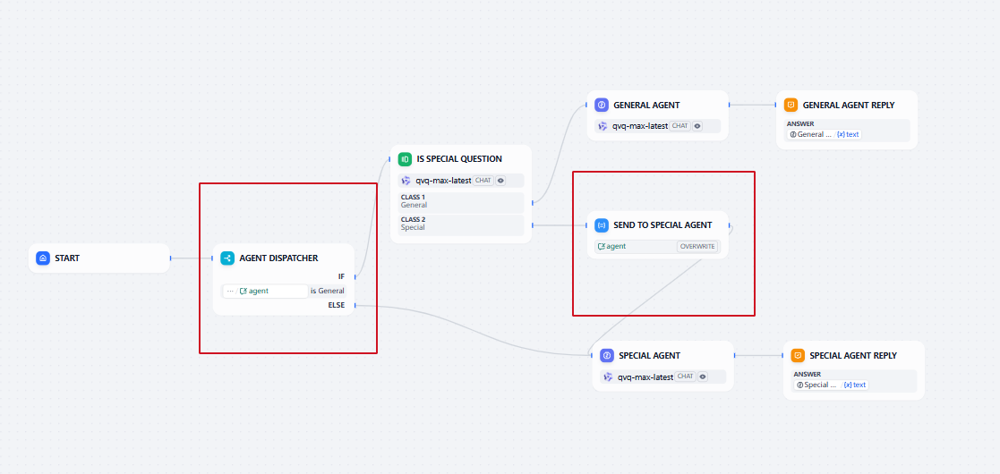
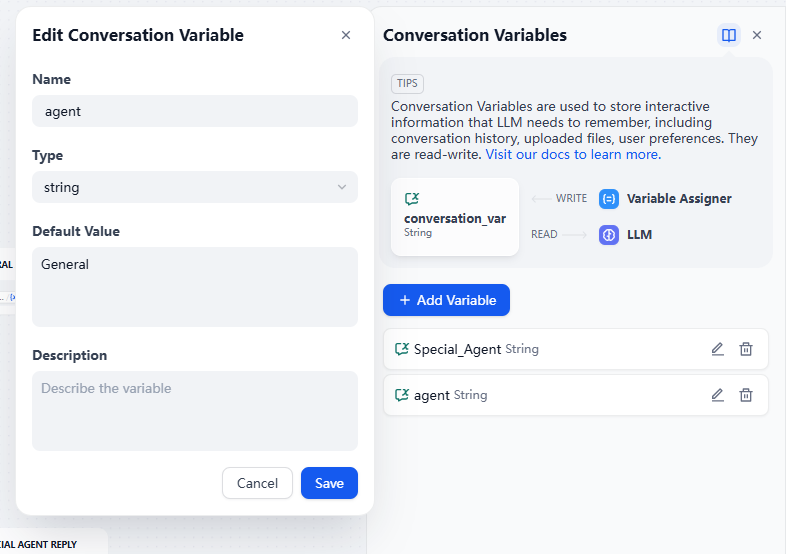
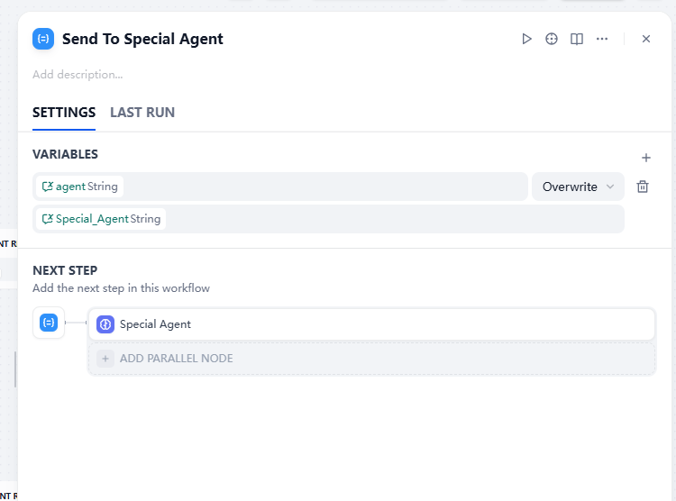

## Problem

We consider a case where you have a general agent (e.g. a general chat agent) and a special agent (e.g. a technical support), you usually use a Question Classifier to decide which agent should take over. The problem is, even if a user has a technical question, not all his consequent question will be classified as tech related, because it's hard for the "Question Classifer" to consider all the cases and route the query correctly.

## Solution
We can set the state for our chatflow using "Conversation Variable". In the example we have a parameter called `agent`, the default value is "general". The first time the Question Classifer decides that special agent should be called, we set the `agent` parameter to "special", all the queries afterwards will go to special agent. 

This can be exetended to more types of agents, and we can add path for agent to route the query back, simulate dipatcher of agents on a phone.
[Sample DSL](./agent%20dispatcher%20demo.yml)

## Comment
It's easy to understand, and make the chatflow more stable and predictable. I feel the solution is not graceful as we need 2 different nodes and 2 variables. Dify doesn't have switch-case node also make it more ugly.